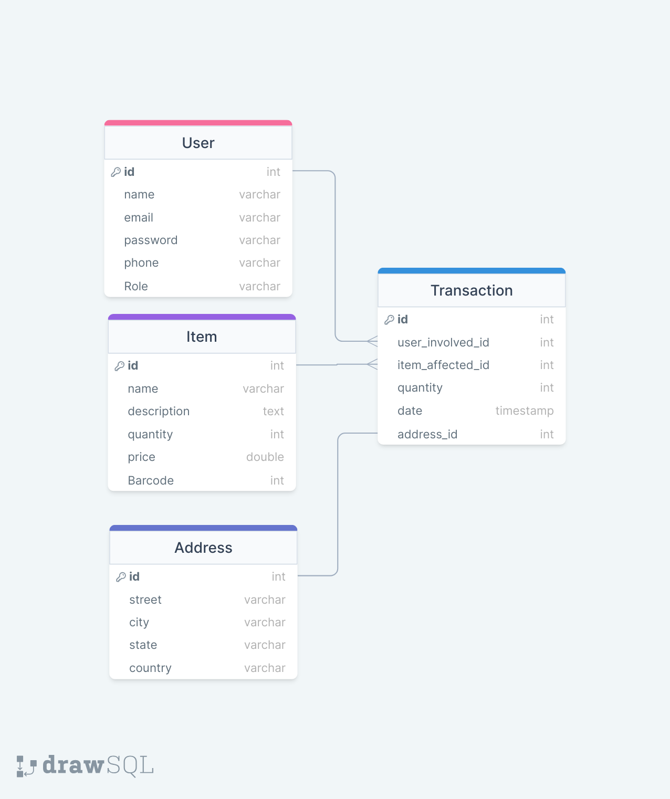

# Inventory Management System

## Technologies Used

- Database Design: drawsql
- API Specification: OpenAPI specification 3.1.0/Swagger
- Backend Framework: Spring Boot
- APIs Testing: Postman
- Database: Mysql

## Table of Contents
- [Description](#description)
- [ER Diagram](#er-diagram)
- [Features](#features)
- [Documentation](#documentation)
- [API Files Structure](#api-files-structure)
- [API Specification](#api-specification)
## Description
This is an inventory management system designed to track and manage inventory efficiently. The system focuses on four core resources: User, Address, Item, and Transaction.

-  The **`User`** resource represents individuals who have access to the system. Users are assigned specific roles that determine their permissions and capabilities within the inventory management system. These roles can include roles such as Administrator, Manager, or Employee.
`Administrators` have full access and control over the system. They can perform all actions.
`Managers` have elevated privileges and can perform most actions related to inventory management. They can add, update, and remove items from the inventory within their assigned departments or areas of responsibility. Managers also can monitor the activities of employees within their team.
`Employees` have limited access and are typically responsible for operations within the inventory management system. They can perform actions such as adding new items and updating item details. However, employees may have restrictions on certain administrative or managerial functions. 

-  The **`Address`** resource captures the location information associated with items inventory. It allows for efficient tracking of the physical address or location of items within the inventory.

-  The **`Item`** resource represents the individual products or items that are part of the inventory. Users can add new items, update their details, and remove items when necessary. This resource helps maintain an accurate and up-to-date record of the inventory.

-  The **`Transaction`** resource tracks the movement and history of items within the system. It records details such as when an item was added, when it was updated or modified, and when it was removed or involved in a transaction. This resource provides a comprehensive audit trail and enables better inventory control.

## ER Diagram

Provide a detailed description of your inventory management system project. Explain its purpose, the problem it aims to solve, and any key features or functionalities.

## Features

- User Management: Create and manage user accounts with different roles and permissions. Administrators have full access, while managers and employees have restricted access based on their responsibilities.

- Item Management: Add, update, and remove items from the inventory. Each item is associated with relevant information such as SKU, name, description, quantity, and address.

- Address Management: Capture and track addresses associated with inventory items. Efficiently manage the physical locations or addresses where items are stored or associated.

- Transaction Tracking: Record and track the movement of items within the system. Capture details such as item receipts, transfers, sales, and returns to maintain an accurate transaction history.

## Documentation

 ## `User`

| Collection Resource (/users) |                     |                  |                              |                        |                  |
|------------------------------|---------------------|------------------|------------------------------|------------------------|------------------|
| HTTP Request (Method URI)    | Operation           | Description      | HTTP Status Codes            | Request Sample         | Response Sample  |
|------------------------------|---------------------|------------------|------------------------------|------------------------|------------------|
| POST /users                         | Create   | Create a new user| 100 Continue: The server has received the initial part of the request and requires the client to continue with the remainder of the request. 200 OK: The request was successful and the user was created. 400 Bad Request: The request body is missing or contains invalid parameters. 403 Forbidden: The user is not authorized to perform the operation. 404 Not Found: The requested resource could not be found. 500 Internal Server Error: An unexpected error occurred on the server. | {"name":"Nada", "email":"Nadaaboissa@gmail.com", "password":"password123", "phone":"0000000000", "Role":"Administrator"}   | {"id":1,"name":"Nada", "email":"Nadaaboissa@gmail.com", "password":"password123", "phone":"0000000000", "Role":"Administrator"}  |
| GET /users                          | Read  | Retrieve all users | 200 OK: The request was successful and the users are returned. 400 Bad Request: The request parameters are invalid. 403 Forbidden: The user is not authorized to perform the operation. 404 Not Found: The requested resource could not be found. 500 Internal Server Error: An unexpected error occurred on the server. | N/A                    | [{"id":1,"name":"Nada", "email":"Nadaaboissa@gmail.com", "password":"password123", "phone":"0000000000", "Role":"Administrator"}, {"id":2,"name":"Jana", "email":"jana@example.com", "password":"password789", "phone":"4567891230", "Role":"Employee"}] |
| PUT /users/{id}                      | Update/Replace | Update the details of a specific user identified by ID  | 200 OK: The request was successful and the user details are updated. 400 Bad Request: The request parameters are invalid. 403 Forbidden: The user is not authorized to perform the operation. 404 Not Found: The requested resource could not be found. 500 Internal Server Error: An unexpected error occurred on the server.         | {"id":1"name":"Nada", "email":"Nadaaboissa@gmail.com", "password":"password111", "phone":"0590000000", "Role":"Administrator"}  |{"id":1,"name":"Nada", "email":"Nadaaboissa@gmail.com", "password":"password111", "phone":"0590000000", "Role":"Administrator"}  |
| PATCH /users/{id}        | Partial Update/Modify   | Apply partial updates to a specific user by ID | 200 OK: The request was successful and the user details are updated. 400 Bad Request: The request parameters are invalid. 403 Forbidden: The user is not authorized to perform the operation. 404 Not Found: The requested resource could not be found. 500 Internal Server Error: An unexpected error occurred on the server.| {"phone":"9876543210"} | {"id":2,"name":"Jana", "email":"jana@example.com", "password":"password789", "phone":"9876543210", "Role":"Employee"}  |
| DELETE /users/{id}           | Delete   | Delete a specific user by ID  | 200 OK: The request was successful and the user is deleted. 400 Bad Request: The request parameters are invalid. 403 Forbidden: The user is not authorized to perform the operation. 404 Not Found: The requested resource could not be found. 500 Internal Server Error: An unexpected error occurred on the server.| N/A               | N/A                 |
| GET /users/{id}                          | Read user info  | Retrieve the details of a specific user by ID | 200 OK: The request was successful and the user details are returned. 400 Bad Request: The request parameters are invalid. 403 Forbidden: The user is not authorized to perform the operation. 404 Not Found: The requested resource could not be found. 500 Internal Server Error: An unexpected error occurred on the server. | N/A                    | {"id":2,"name":"Jana", "email":"jana@example.com", "password":"password789", "phone":"9876543210", "Role":"Employee"} |

## `Item`

| Collection Resource (/items) |                     |                  |                              |                        |                  |
|------------------------------|---------------------|------------------|------------------------------|------------------------|------------------|
| HTTP Request (Method URI)    | Operation           | Description      | HTTP Status Codes            | Request Sample         | Response Sample  |
|------------------------------|---------------------|------------------|------------------------------|------------------------|------------------|
| POST /items                         | Create  | Create an item| 201 Created: The item was successfully created 400 Bad Request: The request body is missing or contains invalid parameters 403 Forbidden: The user is not authorized to perform the operation 500 Internal Server Error: An unexpected error occurred on the server.| {"name":"Table","description":"Wooden table","quantity":1,"price":299.99,"barcode":123456789}  | {"id":1,"name":"Table","description":"Wooden table","quantity":1,"price":299.99,"barcode":123456789}|
| GET /items                         | Read  | Retrieve all items | 200 OK: The request was successful 500 Internal Server Error: An unexpected error occurred          | N/A                    | [{"id":1,"name":"Table","description":"Wooden dining table","quantity":1,"price":299.99,"barcode":123456789}] |
| PUT /items/{id}                          | Update/Replace | Update an item by ID | 200 OK: The request was successful 400 Bad Request: The request body is missing or contains invalid parameters 403 Forbidden: The user is not authorized 404 Not Found: The requested item could not be found 500 Internal Server Error: An unexpected error occurred| {"name":"Table","description":"Updated dining table","quantity":2,"price":399.99,"barcode":123456789}              | {"id":1,"name":"Table","description":"Updated dining table","quantity":2,"price":399.99,"barcode":123456789} |
| PATCH /items/{id}                          | Partial Update/Modify  | Partially update an item by ID  | 200 OK: The request was successful 400 Bad Request: The request body is missing or contains invalid parameters 403 Forbidden: The user is not authorized 404 Not Found: The requested item could not be found 500 Internal Server Error: An unexpected error occurred| {"price": 349.99} |{"id":1,"name":"Table","description":"Wooden dining table","quantity":1,"price":349.99,"barcode":123456789} |
| DELETE /items/{id}                       | Delete   | Delete an item by ID                           | 200 OK: The request was successful 403 Forbidden: The user is not authorized 404 Not Found: The requested item could not be found 500 Internal Server Error: An unexpected error occurred | N/A                | N/A                 |
| GET /items/{id}                          | Read item info  | Retrieve a specific item by ID | 200 OK: The request was successful 404 Not Found: The requested item could not be found       | N/A             |{"id":1,"name":"Table","description":"Wooden dining table","quantity":1,"price":299.99,"barcode":123456789} |

## `Address`

| Collection Resource (/Addresses) |                     |                  |                              |                        |                  |
|------------------------------|---------------------|------------------|------------------------------|------------------------|------------------|
| HTTP Request (Method URI)    | Operation           | Description      | HTTP Status Codes            | Request Sample         | Response Sample  |
|------------------------------|---------------------|------------------|------------------------------|------------------------|------------------|
| POST /addresses                         | Create   | Create a new address| 201 Created: The address was successfully created 400 Bad Request: The request body is missing or contains invalid parameters | {"street":"123 Main St", "city":"Ramallah", "state":"West Bank", "country":"Palestine"}   | {"id": 1, "street":"123 Main St", "city":"Ramallah", "state":"West Bank", "country":"Palestine"}|
| GET /addresses                          | Read  | Retrieve all addresses | 200 OK: The request was successful     | N/A                    | [{"id": 1, "street":"123 Main St", "city":"Ramallah", "state":"West Bank", "country":"Palestine"}, {"id": 2, "street":"456 ABC", "city":"Nablus", "state":"West Bank", "country":"Palestine"}] |
| PUT /addresses/{id}                          | Update/Replace | Update a specific address by ID | 200 OK: The request was successful 400 Bad Request: The request body is missing or contains invalid parameters 404 Not Found: The requested address could not be found | {"street":"456 ABC", "city":"Nablus", "state":"West Bank", "country":"Palestine"}                | {"id": 1, "street":"456 ABC D", "city":"Nablus", "state":"West Bank", "country":"Palestine"} |
| PATCH /addresses/{id}                          | Partial Update/Modify   | Partially update a specific address  | 200 OK: The request was successful 400 Bad Request: The request body is missing or contains invalid parameters 404 Not Found: The requested address could not be found| {"city":"Bethlehem"} | {"id": 1, "street":"123 Main St", "city":"Bethlehem", "state":"West Bank", "country":"Palestine"} |
| DELETE /addresses/{id}                       | Delete  | Delete a specific address     | 200 OK: The request was successful 404 Not Found: The requested address could not be found | N/A                | N/A                 |
| GET /addresses/{id}                          | Read address info  | Retrieve a specific address | 200 OK: The request was successful 404 Not Found: The requested address could not be found                     | N/A                    | {"id": 1, "street":"123 Main St", "city":"Ramallah", "state":"West Bank", "country":"Palestine"}|

## `Transaction`

| Collection Resource (/transactions) |                     |                  |                              |                        |                  |
|------------------------------|---------------------|------------------|------------------------------|------------------------|------------------|
| HTTP Request (Method URI)    | Operation           | Description      | HTTP Status Codes            | Request Sample         | Response Sample  |
|------------------------------|---------------------|------------------|------------------------------|------------------------|------------------|
| POST /transactions                         | Create  | Create a new transaction| 201 Created: The transaction was successfully created 400 Bad Request: The request body is missing or contains invalid parameters | {"user_involved_id": 1, "item_affected_id": 2, "quantity": 5, "date": "2024-04-05T10:30:00Z", "address_id": 3}  | {"id": 1, "user_involved_id": 1, "item_affected_id": 2, "quantity": 5, "date": "2024-04-05T10:30:00Z", "address_id": 3}  |
| GET /transactions| Read  | Retrieve all transactions | 200 OK: The request was successful    | N/A                    | [{"id": 1, "user_involved_id": 1, "item_affected_id": 2, "quantity": 5, "date": "2024-04-05T10:30:00Z", "address_id": 3}, {"id": 2, "user_involved_id": 2, "item_affected_id": 3, "quantity": 3, "date": "2024-04-05T11:45:00Z", "address_id": 4}]|
| PUT /transactions/{id}                          | Update/Replace | Update a specific transaction by ID | 200 OK: The request was successful 400 Bad Request: The request body is missing or contains invalid parameters 404 Not Found: The requested transaction could not be found| {"user_involved_id": 1, "item_affected_id": 2, "quantity": 8, "date": "2024-04-05T14:15:00Z", "address_id": 3}               | {"id": 1, "user_involved_id": 1, "item_affected_id": 2, "quantity": 8, "date": "2024-04-05T14:15:00Z", "address_id": 3}  |
| PATCH /transactions/{id}                          | Partial Update/Modify   | Partially update a specific transaction by ID   | 200 OK: The request was successful 400 Bad Request: The request body is missing or contains invalid parameters 404 Not Found: The requested transaction could not be found | {"quantity": 10}| {"id": 1, "user_involved_id": 1, "item_affected_id": 2, "quantity": 10, "date": "2024-04-07T10:30:00Z", "address_id": 3} |
| DELETE /transactions/{id}                       | Delete  | Delete a specific transaction                                 | 200 (OK) 404 (Not Found) | N/A                | N/A                 |
| GET /transactions/{id}                          | Read transaction info  | Retrieve a specific transaction |200 OK: The request was successful 404 Not Found: The requested transaction could not be found | N/A                    | {"id": 1, "user_involved_id": 1, "item_affected_id": 2, "quantity": 5, "date": "2024-04-05T10:30:00Z", "address_id": 3} |

---
## API Files Structure

The structure of the project files follows the conventions of a typical Spring Boot project:

├── src/                                                                             
│&nbsp;&nbsp;&nbsp;&nbsp;&nbsp;&nbsp;&nbsp;├── main/                                                                                 
│&nbsp;&nbsp;&nbsp;&nbsp;&nbsp;&nbsp;&nbsp;│&nbsp;&nbsp;&nbsp;&nbsp;&nbsp;&nbsp;├── java/ [ controller , service , model , repository , InventoryManagementSystemRestApIsApplication.java ]                                                                        
│&nbsp;&nbsp;&nbsp;&nbsp;&nbsp;&nbsp;&nbsp;│&nbsp;&nbsp;&nbsp;&nbsp;&nbsp;&nbsp;└── resources/                                                                   
│&nbsp;&nbsp;&nbsp;&nbsp;&nbsp;&nbsp;&nbsp;│&nbsp;&nbsp;&nbsp;&nbsp;&nbsp;&nbsp;&nbsp;&nbsp;&nbsp;&nbsp;&nbsp;&nbsp;&nbsp;&nbsp;├── static/                                                                            
│&nbsp;&nbsp;&nbsp;&nbsp;&nbsp;&nbsp;&nbsp;│&nbsp;&nbsp;&nbsp;&nbsp;&nbsp;&nbsp;&nbsp;&nbsp;&nbsp;&nbsp;&nbsp;&nbsp;&nbsp;&nbsp;├── templates/                                                                    
│&nbsp;&nbsp;&nbsp;&nbsp;&nbsp;&nbsp;&nbsp;│&nbsp;&nbsp;&nbsp;&nbsp;&nbsp;&nbsp;&nbsp;&nbsp;&nbsp;&nbsp;&nbsp;&nbsp;&nbsp;&nbsp;└── application.properties                                                           
│&nbsp;&nbsp;&nbsp;&nbsp;&nbsp;&nbsp;&nbsp;└── test/                                                                                                                                                           
│&nbsp;&nbsp;&nbsp;&nbsp;&nbsp;&nbsp;&nbsp;&nbsp;&nbsp;&nbsp;&nbsp;&nbsp;&nbsp;└── java/                                                                     
│&nbsp;&nbsp;&nbsp;&nbsp;&nbsp;&nbsp;&nbsp;&nbsp;&nbsp;&nbsp;&nbsp;&nbsp;&nbsp;&nbsp;&nbsp;&nbsp;&nbsp;&nbsp;&nbsp;&nbsp;&nbsp;└── postman/                                                               
│&nbsp;&nbsp;&nbsp;&nbsp;&nbsp;&nbsp;&nbsp;&nbsp;&nbsp;&nbsp;&nbsp;&nbsp;&nbsp;&nbsp;&nbsp;&nbsp;&nbsp;&nbsp;&nbsp;&nbsp;&nbsp;&nbsp;&nbsp;&nbsp;&nbsp;&nbsp;&nbsp;&nbsp;&nbsp;└── InventoryManagementSystem.postman_collection.json                       
│                                                          
├── build.gradle                                                              
└── ...                                                                                    

## API Specification

For more information about the API endpoints and usage, please refer to the [API Specification](https://app.swaggerhub.com/apis/NADAABOISSA_1/Inventory_Management_System_Rest_API/1.0.0) document.